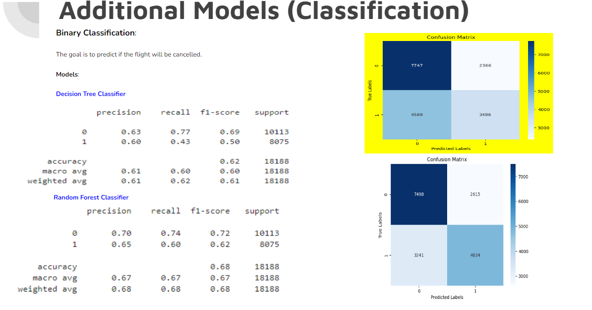
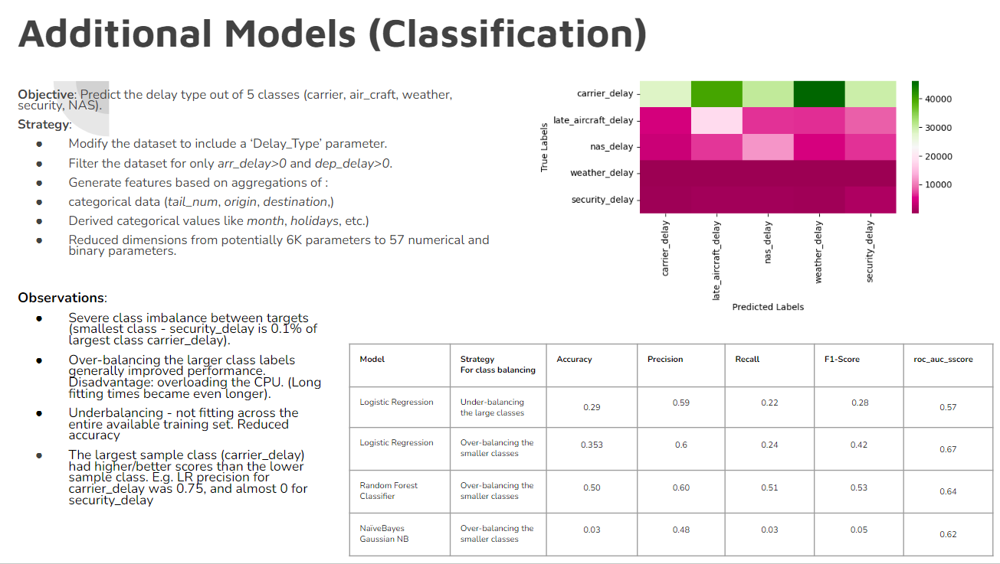

# Mid-Term Project

# Goal:

### PRIMARY OBJECTIVE (Regression):

- Predict flight delays using only information available 1 week before the flight

### SECONDARY OBJECTIVES (Classification):

- Predict what type of delay it will be given a plane is delayed

- Predict whether a flight will be cancelled or not

# Process

|Process |   Folder/Notebook |
|:-|:-|
|Data wrangling, EDA, Feature engineering |***CleaningTableFlights\Cleaning and some EDA.ipynb, EDA_questions\Cleaning_for_questions.ipynb, EDA_questions\SecondaryTablesEDA.ipynb, Modeling\EDA_for_models.ipynb***|
|Exploratory analysis|***EDA_questions\Task 1.ipynb ...***|
|Modeling |***Modeling\Modeling_DecisionTree_Classifier.ipynb ...***|

# Results

## Observations

- Time is a factor in delays, the later in the day the more delay (more capacity to be delayed by other flights

- Longer flights were less likely to be delayed than shorter ones

- Instances where one carrier ran the flight under another carriers name (op_carrier != mkt_carrier) were more likely to be delayed

- Certain airports and airlines were more / less likely to have delays. Generally the busier the more delays

# Limitations

Predicting a week in advance limits predictive power of the model 
- A weather forecast isn’t as accurate a week out compared to a day out

- Much of what causes an aircraft to be late is dependent on last minute factors (crew, other planes, etc.)

Data leakage on some average variables (included training set; to be addressed)

Data doesn’t include passenger or crew information on a flight by flight basis

Also doesn’t include maintenance / performance information for each plane

High class imbalance for classification (e.g. low number of cancellations)

Unable to use whole dataset due to machine limitations

# Future Work

- Move prediction date closer to target date (e.g. 1 day in advance)

- Use employee information (e.g. # of employees working that day, # crewing flight, attendance records)

- Use flight level passenger information

- Use maintenance / performance metrics for each plane

- Train models using full dataset instead of a sample

